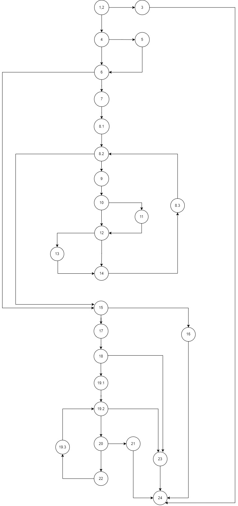

<h1>Втора лабораториска вежба по Софтверско инженерство</h1>
<h2>Сара Тошевска 213085</h2>
<h3>Control Flow Graph</h3>

<h3>Цикломатска комплексност</h3>

Цикломатската комплексност на овој код е 11, истата ја добив преку формулата P+1, каде што P е бројот на предикатни јазли. Во случајoв P=10, па цикломатската комплексност изнесува 11.

